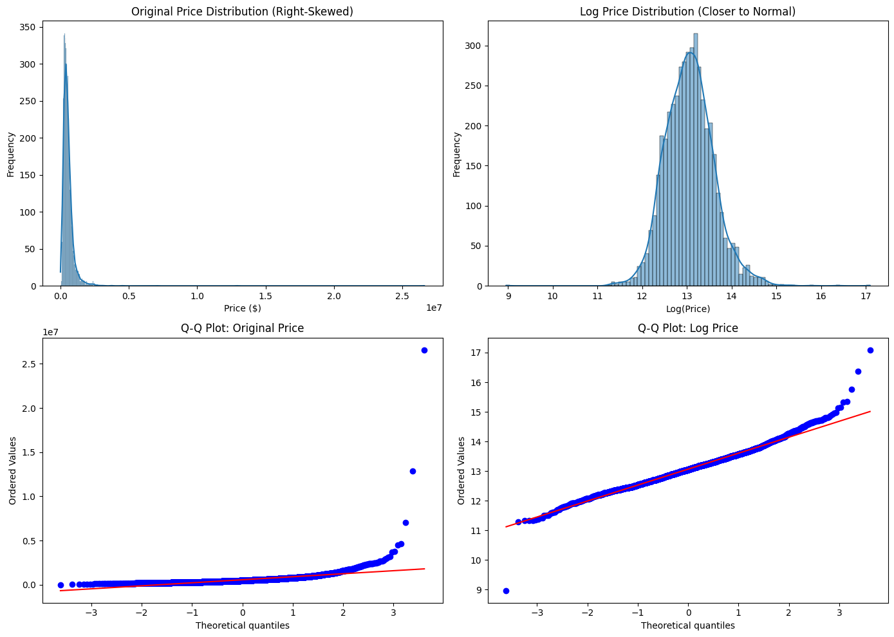
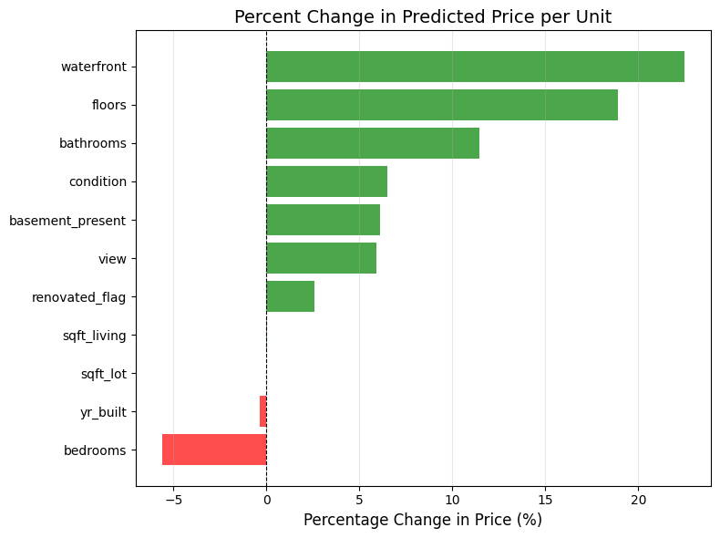
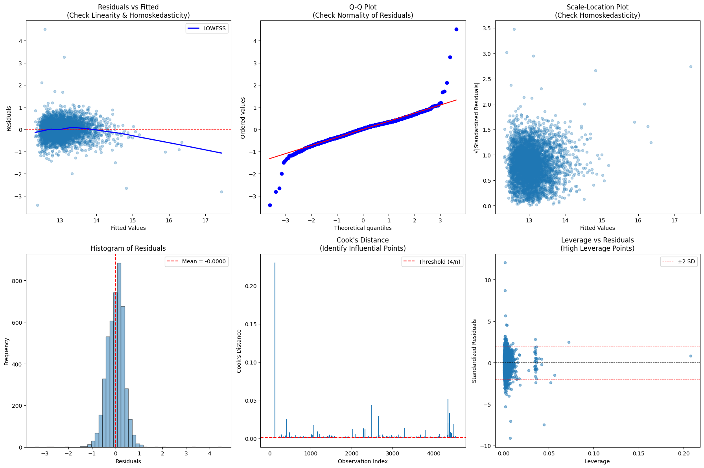

# House Prices in the Seattle Area: A Regression With Diagnostics

A linear model of home sale prices, with the checks that decide how far its coefficients can be trusted: residual diagnostics, influential points, robust refits and an out-of-sample test.

Team 3 final project for Statistical Models for Data Science (ADSP 31014), MS in Applied Data Science, University of Chicago, Autumn 2025. The notebook here is my extended version of our team notebook (see [My role](#my-role)).

## Data

[House Price Prediction](https://www.kaggle.com/datasets/shree1992/housedata) on Kaggle: 4,600 home sales in 44 Washington cities, May 2 to July 10, 2014, with price, size, rooms, lot, floors, view, condition, waterfront, year built, year renovated and address. The file is not included here. See [data/README.md](data/README.md).

Cleaning:
- Dropped 49 sales with a price of 0 and 2 homes listed with 0 bedrooms and 0 bathrooms, leaving 4,549.
- Modeled the log of price, which removes most of the right skew.
- Dropped `sqft_above` (correlation 0.88 with living area) and replaced year renovated and basement area with yes/no flags.
- Dropped the address fields (street, city, zip code), so the model has no location variables.



## Approach

1. Forward selection by AIC over 11 candidate features. All 11 entered, so the final model is the full model.
2. OLS on log price, with VIF checks for collinearity (all below 3.4).
3. Diagnostics: Breusch-Pagan for heteroskedasticity, Jarque-Bera for normality, Cook's distance for influential points.
4. Robustness: HC3 standard errors, weighted least squares, a refit on a price-trimmed sample, a Huber M-estimator and a refit without the influential points.
5. An 80/20 train-test split to check out-of-sample error.
6. A sensitivity analysis that prices one baseline home and changes one feature at a time.

## Results

The model explains 52% of the variation in log price (adjusted R-squared 0.523). These are associations from an observational model, holding the other features fixed:

| Feature | Associated change in predicted price |
| --- | --- |
| Living area | about +39% per 1,000 sq ft |
| Waterfront | +22% (only 30 waterfront homes in the data) |
| Each additional floor | +19% |
| Each additional bathroom | +11% |
| Condition, per grade | +6.5% |
| Basement | +6.1% |
| View, per grade | +5.9% |
| Each additional bedroom | -5.6% (at the same living area) |
| Year built, per decade newer | -3.4% |
| Lot size, per 10,000 sq ft | -0.7% |
| Renovated | +2.6% (not significant at 5%) |



The plot shows the change per one unit of each feature, so the square-foot features look near zero even though living area is the strongest predictor. The table restates them per 1,000 and 10,000 sq ft. Each percent change is `exp(b*k) - 1`, where b is the coefficient and k the number of units.

**Diagnostics.** The residuals are heteroskedastic (Breusch-Pagan p < 0.001) and heavy-tailed (Jarque-Bera 14,868), and 214 sales (4.7%) are influential by Cook's distance (above 4/n). Most coefficients keep their sign and significance under HC3, the trimmed sample, the Huber estimator and the refit without influential points, though some sizes shift. Without the influential points, the condition and year-built coefficients move by about a third and the bedroom and lot-size coefficients by about a quarter. In the trimmed sample, the basement and condition coefficients move by about a quarter and the small lot-size coefficient by about 40%. Weighted least squares barely changes the fit because its weights are nearly uniform. Waterfront and renovation are the fragile ones: waterfront loses significance at 5% in two of these checks, and renovation, borderline in the main model (p = 0.050), reaches significance only under WLS.



**Out of sample.** On the 20% test set, R-squared on log price is 0.50 (0.53 in training), the mean absolute error is $209,000 and the mean absolute percentage error is 34%. The test RMSE of $1.42 million is driven by one home: a 13,540 sq ft house that sold for $2.28 million but is predicted at $44 million. It accounts for 95% of the test squared error, and without it the test RMSE is $306,000. The last cell of the notebook shows this check.

**Sensitivity.** A baseline home (3 bedrooms, 2.25 bathrooms, 1,920 sq ft, 2 floors, no basement, built in 1990) has a predicted price of $431,000. With waterfront the prediction is $528,000, and with the top view grade it is $542,000. Because the model predicts log price, these back-transformed figures estimate a median price rather than a mean.

## Limitations

- About half the variation in log price is unexplained. With no location variables, neighborhood effects end up in other coefficients, which may be why newer homes are predicted lower.
- The cleaning kept implausible records: a $26.6 million sale of a 1,180 sq ft home, a $7,800 sale, and 193 homes with a renovation year earlier than the year built.
- The data covers ten weeks of 2014 sales, so it says nothing about price trends.
- The model extrapolates badly for very large homes, as the test-set outlier shows.

## My role

The team notebook covered the exploratory analysis, forward selection and a VIF check. My version, in this repo, adds:
- descriptive statistics and a before-and-after log-transform panel
- the coefficient table with percent effects and the coefficient plot
- residual diagnostics and tests
- the out-of-sample evaluation
- the robustness refits (HC3, WLS, trimmed sample, Huber, influence refit)
- the sensitivity analysis

To prepare this repo in October 2026, I made the notebook portable (relative data path, no personal paths or Colab metadata), corrected wording in the markdown, printed text and plot titles and labels, re-ran it end to end with the versions in `requirements.txt` (all numeric results matched the original run) and added the outlier check at the end.

## How to run

Tested with Python 3.13.

```
pip install -r requirements.txt
# save the Kaggle file data.csv as data/data.csv
cd notebook
jupyter notebook house_price_regression.ipynb
```
